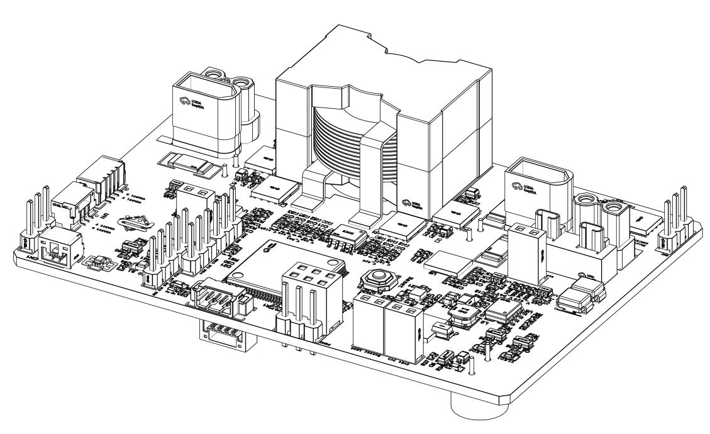

<h3 align="center"> Purdue RM - <i>Boosting your robots!</i></h3>

Abstract | 摘要

This device is a supercapacitor controller based on a 4-switch DC-DC converter. It can charge the parallel capacitor bank as much as possible while ensuring that the output on the battery side does not exceed the rated power, and it maintains the voltage measured at the motor around 24V. Additionally, this device can automatically detect the power measured at the motor (load) and provide feedback to the upper computer via CAN, allowing the upper computer to freely control the power of each motor (or load). In special cases, such as when the stored energy in the capacitors is depleted, this controller can automatically disconnect the capacitors and issue a warning to the upper computer through programmable CAN signals or UART signals.   
本设备是一款基于4开关DCDC的超级电容控制器。它能在保证电池侧输出不超过额定功率的前提下，尽可能地给并联的电容组充电，并保证电机测的电压尽可能维持在24V左右；同时，本设备能够自动检测电机（负载）测的功率，通过CAN反馈给上位机，以此能让上位机自由地控制各个电机（或负载）的功率。在特殊情况下，比如在电容储存的能量耗尽之后，这款控制器能够自动断开电容，并且通过可编程CAN信号或者UART信号警告上位机。

# PurdueRMSuperCap (Current: 1.0 hardware Finish， documenting) 
This document was created for Super-Capacitor testing and opensource in Purdue Robomaster. This document includes  
1. Preface | 前言
2. Quickstart | 速通教程
3. Datasheet and design note | 规格书与开源设计笔记
4. Introduce level video | 从零开始的视频教程
5. More information | 更多信息

## Preface | 前言
This section will introduce the project and briefly outline the author's suggestions for learning about superconducting design.
This open-source file consists of three parts: the Quick Start Application Manual, the Specification Document, and the Design Notes.
If you need to quickly use the superconducting device, please refer to the Quick Start Application Manual.
If you need a detailed understanding of how the superconducting device works and possibly modify it, you can read the Specification Document.
If you want to learn about the design of the superconducting device, please read both the Specification Document and the Design Notes.
本部分将介绍本项目，同时简单说明作者对于学习超电设计的一些建议
本开源文件有三个部分：速通应用手册、规格文档、设计笔记
如果你需要快速使用超电，请使用速通应用手册
如果你需要详细了解超电的工作原理，甚至适当地修改本设备，可以阅读规格文档
如果你需要学习超电的设计，请阅读规格文档和设计笔记

## Quickstart | 速通教程
什么是超电？
游戏截图
1. 机器人功率分析 -> 我应该如何测量底盘功率
机器人底盘的功率和机器人速度成正比,如果机器人结构,重量不变,速度越快,功率越大
其中值得注意的3508电机的反馈电流(见图)并不是马达的电流,详情请看datasheet的xx章节
What should I do?
连接裁判系统测试,记录下来多快的时候机器人功率是45W左右，其中控制图应该如下（以3508为例子），在本例子中，合适的速度将会是Ym/s
3. 超电工作能力 -> 我应该如何使用超电逻辑
下图是超电工作的三种情况,分别是充电,放电,平衡,其中电池的限定功率(在Robomaster比赛中,这就是裁判系统的功率),图中的限定功率是45W
图1图2图3
其中,机器人一开始是充电状态，底盘不用电，超电开始充电，当比赛的时候，底盘一开始正常运行
What should I do?
设置一个按键，将机器人的速度提升20%（或者你觉得合适的数字）继续使用上一章节的图将会如下
4. 裁判系统 -> 我应该如何使用裁判系统
比赛的时候随着升级，功率将会提升（参考裁判文档xxx页）
What should I do?
通过实验记录一个表格，指出不同等级下功率限制多少，同时速度和功率的对应关系如何
同时，如果功率有变，那么将信息发给超电，如果没有修改过固件，通过CAN bus通讯发送的数据应该如下所示
table
注意：升级之后如果机器人跑的更加快，那么务必将信息发给超电，要不然超电会在正常运行（比如Y_2 m/s）的时候进入放电状态，从而使得加速状态的时候电容已经没有电量了
6. 工作情况演示
待：vofa表格

## Datasheet and design note | 规格书和开源设计笔记
the datasheet is not finished yet，以下展示了目前对于本规格书的计划
9/22
9/29
10/6 (Fall break)
10/13
10/20 Finish

## Introduce level video | 从零开始的视频教程
视频教程正在制作中

## More information | 更多信息
not yet
