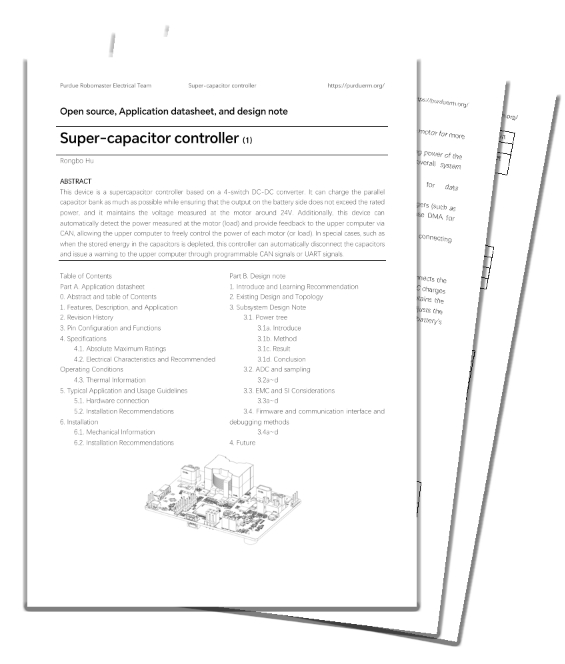

<h3 align="center"> Purdue RM - <i>Boosting your robots!</i></h3>

<h2><strong>This project is not official published yet</strong></h2>

<h2><strong>Abstract | 摘要</strong></h2>

This device is a supercapacitor controller based on a 4-switch DC-DC converter. It can charge the parallel capacitor bank as much as possible while ensuring that the output on the battery side does not exceed the rated power, and it maintains the voltage measured at the motor around 24V. Additionally, this device can automatically detect the power measured at the motor (load) and provide feedback to the upper computer via CAN, allowing the upper computer to freely control the power of each motor (or load). In special cases, such as when the stored energy in the capacitors is depleted, this controller can automatically disconnect the capacitors and issue a warning to the upper computer through programmable CAN signals or UART signals.  

本设备是一款基于4开关DCDC的超级电容控制器。它能在保证电池侧输出不超过额定功率的前提下，尽可能地给并联的电容组充电，并保证电机测的电压尽可能维持在24V左右；同时，本设备能够自动检测电机（负载）测的功率，通过CAN反馈给上位机，以此能让上位机自由地控制各个电机（或负载）的功率。在特殊情况下，比如在电容储存的能量耗尽之后，这款控制器能够自动断开电容，并且通过可编程CAN信号或者UART信号警告上位机。

<h2><strong>Cuurent Status | 当前进展</strong></h2>

Code v1.0: ▓▓▓▓▓▓▓▓▓░  

Datasheet v1.0: ▓▓▓▓░░░░░░  

Video v1.0: ░░░░░░░░░░

# PurdueRMSuperCap
This document was created for Super-Capacitor testing and opensource in Purdue Robomaster. This document includes  
1. Preface | 前言
2. Quickstart | 速通教程
3. Datasheet and design note | 规格书与开源设计笔记
4. Introduce level video | 从零开始的视频教程
5. More information | 更多信息

## Preface | 前言
This section will introduce the project and briefly outline the author's suggestions for learning about Super-Capacitor design.  
This open-source file consists of three parts: the Quickstart , the datasheet, and the Design Notes.  
If you need to quickly use the Super-Capacitor device, please refer to the Quickstart.  
If you need a detailed understanding of how the Super-Capacitor device works and possibly modify it, you can read the Specification Document.  
If you want to learn about the design of the superconducting device, please read both the Specification Document and the Design Notes.  
本部分将介绍本项目，同时简单说明作者对于学习超电设计的一些建议  
本开源文件有三个部分：速通教程、数据手册、设计笔记  
如果你需要快速使用超电，请使用速通教程  
如果你需要详细了解超电的工作原理，甚至适当地修改本设备，可以阅读数据手册  
如果你需要学习超电的设计，请阅读数据手册和设计笔记  

## Quickstart | 速通教程
What is Super-Capacitor  
1. What is battery power -> How to control battery power  
2. Ability of Super-Capacitor -> What situation the Super-Capacitor will work
3. Referee system -> In the Robomaster competition, What should I do
4. Wroking condition

## Datasheet and design note | 数据手册和开源设计笔记
<h3 align="center">
</h3>

the datasheet is not finished yet, this is plan. You can take look of the current version.   
9/29 Finish the Specifications and Typical Application and Usage Guidelines (Not include images)
10/6 (Fall break) Finish the Installation and Power tree   
10/13 Finish all testing cases  
10/20 Subsystem Design Note  
10/27 Finish datasheets  

## Introduce level video | 从零开始的视频教程
In the progress  

## More information | 更多信息
not yet
future plan:  
Boost phase  
Saved data for restart  